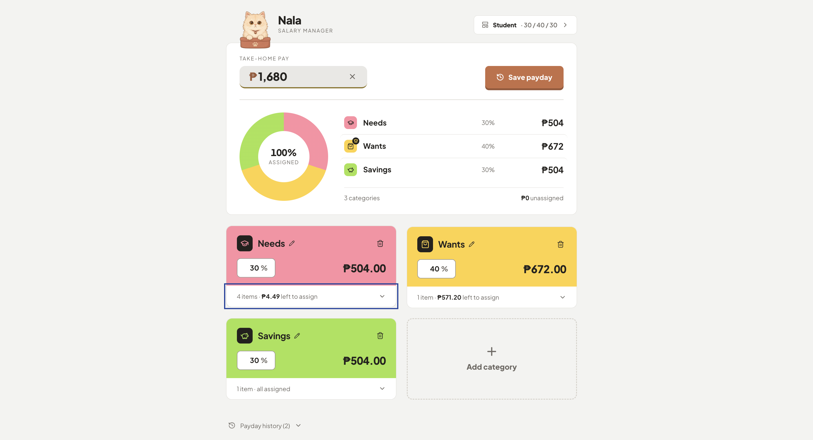

# Nala - Salary Manager

A simple payday budget splitter for turning one salary into a clear spending plan.

[Open the live app](https://nala-salary-manager.vercel.app/)



Nala divides a take-home paycheck into editable categories such as Needs,
Wants, and Savings. Each category can have its own percentage and sub-category
breakdown, so you can plan a payday without a spreadsheet.

## What it does

- Start from a ready-made split template or create your own.
- Enter a payday amount and see the allocation update instantly.
- Add, rename, and delete categories and sub-categories.
- Save payday snapshots and restore them from local history.
- Keep data private in the browser with no backend or account required.

## Built with

React, TypeScript, Vite, Tailwind CSS, and Lucide icons.

## Run it

You need [Node.js](https://nodejs.org) installed (18+ recommended).

```bash
npm install
npm run dev
```

Then open the URL it prints (usually http://localhost:5173) in your browser.

## Data storage

Your categories, percentages, and payday history are saved in your browser's
localStorage under the `salary-manager:` prefix. This means:

- Data persists between sessions, as long as you use the same browser on the
  same machine.
- Clearing your browser's site data for `localhost` will erase it.
- It does not sync across devices or browsers.

## Build for production

```bash
npm run build
npm run preview
```

This creates a static `dist/` build suitable for deployment.
